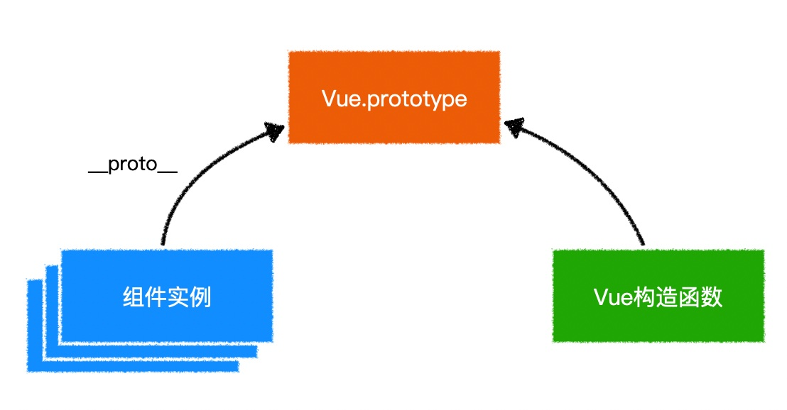

 


# 使用css module

需要将样式文件命名为`xxx.module.ooo`

`xxx`为文件名

`ooo`为样式文件后缀名，可以是`css`、`less`


# 得到组件渲染的Dom

```js
  /**
    获取某个组件渲染的Dom根元素
  */
function getComponentRootDom(comp, props){
  const vm = new Vue({
    render: h => h(comp, {props})
  })
  vm.$mount();
  return vm.$el;
}
```


# 扩展vue实例



# ref

```html
<template>
	<div>
    <p ref="para">some paragraph</p>
    <ChildComp ref="comp" />
    <button @click="handleClick">查看所有引用</button>
  </div>
</template>

<script>
  import ChildComp from "./ChildComp"
	export default {
    components:{
      ChildComp
    },
    methods:{
      handleClick(){
        // 获取持有的所有引用
        console.log(this.$refs);
        /*
        {
        	para: p元素（原生DOM）,
        	comp: ChildComp的组件实例
        }
        */
      }
    }
  }
</script>
```


> 通过`ref`可以直接操作`dom`元素，甚至可能直接改动子组件，这些都不符合`vue`的设计理念。
>


## `除非迫不得已，否则不要使用`ref

不符合VUE的设计理念
