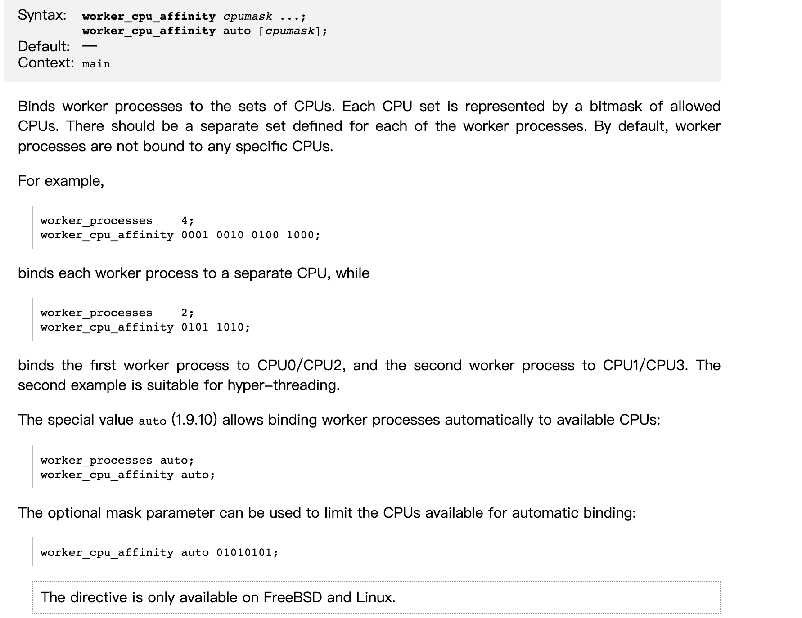
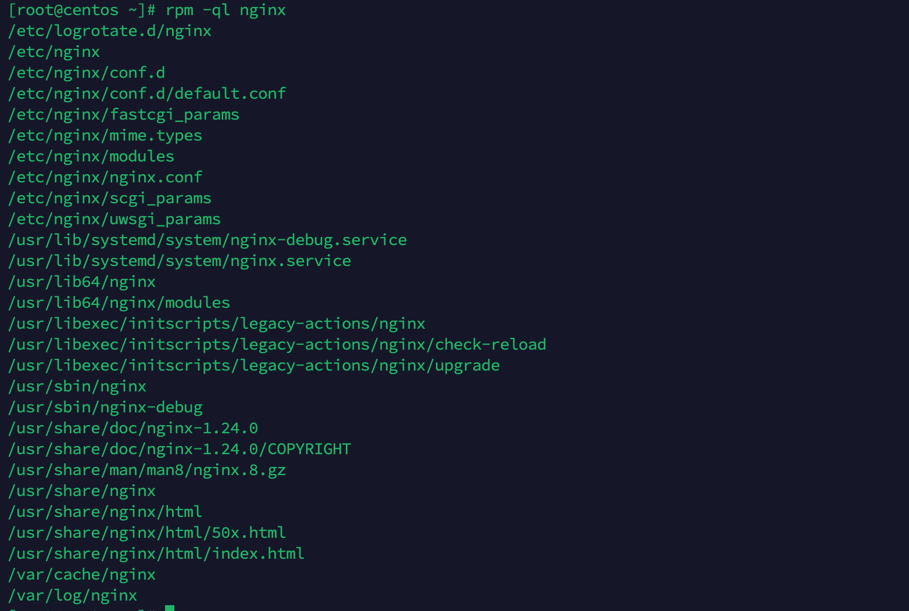

# Nginx 基本知识及用法

> 基本环境安装

```shell
$ yum -y install gcc gcc-c++ autoconf pcre pcre-devel make automake 

$ yum -y install wget httpd-tools vim
```


只针对测试服务器

关闭iptables 规则

```shell
$ iptables -L
## 关闭
$ iptables -F

$ iptables -t nat -L
## 关闭
$ iptables -t nat -F
```

关闭selinux

```shell
## 查看
$ getenforce
## 关闭
$ setenforce 0
```


## Nginx 优点
### IO多路复用 epoll 模型

### CPU亲和

> 官方文档  [Core functionality (nginx.org)](http://nginx.org/en/docs/ngx_core_module.html#worker_cpu_affinity)



## Nginx 快速安装

> 官方安装文档 [nginx: Linux packages](http://nginx.org/en/linux_packages.html#RHEL-CentOS)

```shell
$ yum install yum-utils
```

To set up the yum repository, create the file named `/etc/yum.repos.d/nginx.repo` with the following contents:

> ```
> [nginx-stable]
> name=nginx stable repo
> baseurl=http://nginx.org/packages/centos/$releasever/$basearch/
> gpgcheck=1
> enabled=1
> gpgkey=https://nginx.org/keys/nginx_signing.key
> module_hotfixes=true
> 
> [nginx-mainline]
> name=nginx mainline repo
> baseurl=http://nginx.org/packages/mainline/centos/$releasever/$basearch/
> gpgcheck=1
> enabled=0
> gpgkey=https://nginx.org/keys/nginx_signing.key
> module_hotfixes=true
> ```

By default, the repository for stable nginx packages is used. If you would like to use mainline nginx packages, run the following command:

> ```
> sudo yum-config-manager --enable nginx-mainline
> ```

To install nginx, run the following command:

> ```
> sudo yum install nginx
> ```

When prompted to accept the GPG key, verify that the fingerprint matches `573B FD6B 3D8F BC64 1079 A6AB ABF5 BD82 7BD9 BF62`, and if so, accept it.


配置 /etc/yum.repo.d/nginx.repo

```shell
[nginx-stable]
name=nginx stable repo
baseurl=http://nginx.org/packages/centos/$releasever/$basearch/
gpgcheck=1
enabled=1
gpgkey=https://nginx.org/keys/nginx_signing.key
module_hotfixes=true

[nginx-mainline]
name=nginx mainline repo
baseurl=http://nginx.org/packages/mainline/centos/$releasever/$basearch/
gpgcheck=1
enabled=0
gpgkey=https://nginx.org/keys/nginx_signing.key
module_hotfixes=true 
```

查看 nginx 版本

```shell
$ yum list | grep nginx
```

安装稳定版

```shell
$ yum install -y nginx
```


查看 nginx 安装目录及配置文件

```shell
$ rpm -ql nginx
```



## 安装目录


|  路径  | 类型     |  作用   |
|  ----  | ----  | ----  |
| /etc/logrotate.d/nginx | 配置文件 |nginx日志轮转，用于logrotate服务的日志切割  |
| /etc/nginx | 目录、配置文件 |Nginx主配置文件  |
| /etc/nginx/nginx.conf | 目录、配置文件 | |
| /etc/nginx/conf.a | 目录、配置文件 | |
| /etc/nginx/conf.d/default.conf | 目录、配置文件 | |
| /etc/nginx/fastcgi_params | 配置文件 |cgi配置相关，fastcgi配置  |
| /etc/nginx/uwsgi_params   |
| /etc/nginx/scgi_params  |
| /etc/nginx/koi-utf | 配置文件 |编码转换映射转化文件 |
| /etc/nginx/koi-win |  | |
| /etc/nginx/win-utf |  | |
| /usr/lib/systemd/system.nginx-debug.service | 配置文件 |用于配置系统守护进程管理器管理方式  |
| /usr/lib/systemd/nginx-.service |  |  |
| /etc/sysconfig/nginx |  |  |
| /etc/sysconfig/nginx-debug |  |  |
| /usr/lib64/nginx/modules | 目录 |Nginx模块目录 |
| /etc/nginx/modules |  | |
| /usr/sbin/nginx | 命令 |nginx服务的启动管理终端命令 |
| /usr/sbin/nginx-debug |  | |
| /var/cache/nginx | 目录 |Nginx的缓存目录 |
| /var/log/nginx | 目录 |Nginx的日志目录 |

## Nginx.conf 配置详解

```shell

## 设置nginx 服务使用的系统用户
user  nginx;
## 工作进程数 IO复用，启用多个work实现并发处理。一般与cpu个数保持一致
worker_processes  auto;
## nginx错误日志
error_log  /var/log/nginx/error.log notice;
## nginx服务启动时pid  把每次启动的PID记录下来，方便以后查找
pid        /var/run/nginx.pid;

## 事件模块
events {
	## 每个进程容许的最大连接数  最大连接数6535
    worker_connections  1024;
    ## use 定义使用的内核模型
}


http {
    include       /etc/nginx/mime.types;
    default_type  application/octet-stream;

    log_format  main  '$remote_addr - $remote_user [$time_local] "$request" '
                      '$status $body_bytes_sent "$http_referer" '
                      '"$http_user_agent" "$http_x_forwarded_for"';

    access_log  /var/log/nginx/access.log  main;

    sendfile        on;
    #tcp_nopush     on;

	## 超时时间
    keepalive_timeout  65;

    #gzip  on;
    ## 默认加载conf.d下所有的conf配置文件
    include /etc/nginx/conf.d/*.conf;
}
```

### conf.d / default.conf 详解

```shell
server {
    ## 监听端口
    listen       80;
    ## 域名地址
    server_name  localhost;

    #access_log  /var/log/nginx/host.access.log  main;

    location / {
    	## 首页路径
        root   /usr/share/nginx/html;
        ## 首页页面
        index  index.html index.htm;
    }

    #error_page  404              /404.html;

    # redirect server error pages to the static page /50x.html
    #
    error_page   500 502 503 504  /50x.html;
    location = /50x.html {
        root   /usr/share/nginx/html;
    }

    # proxy the PHP scripts to Apache listening on 127.0.0.1:80
    #
    #location ~ \.php$ {
    #    proxy_pass   http://127.0.0.1;
    #}

    # pass the PHP scripts to FastCGI server listening on 127.0.0.1:9000
    #
    #location ~ \.php$ {
    #    root           html;
    #    fastcgi_pass   127.0.0.1:9000;
    #    fastcgi_index  index.php;
    #    fastcgi_param  SCRIPT_FILENAME  /scripts$fastcgi_script_name;
    #    include        fastcgi_params;
    #}

    # deny access to .htaccess files, if Apache's document root
    # concurs with nginx's one
    #
    #location ~ /\.ht {
    #    deny  all;
    #}
}
```

## Nginx虚拟主机及实现方式

```shell
## 检查虚拟主机 Nginx配置文件是否正确
$ nginx -tc /etc/nginx/nginx.conf 

## 停止nginx服务
$ systemctl stop nginx 
## OR
$ nginx -s stop -c /etc/nginx/nginx.conf 

## 启动nginx服务
$ systemctl start nginx 
# OR
$ nginx -c /etc/nginx/nginx.conf 

## 查看本机监听端口
$ ss -luntp

```


